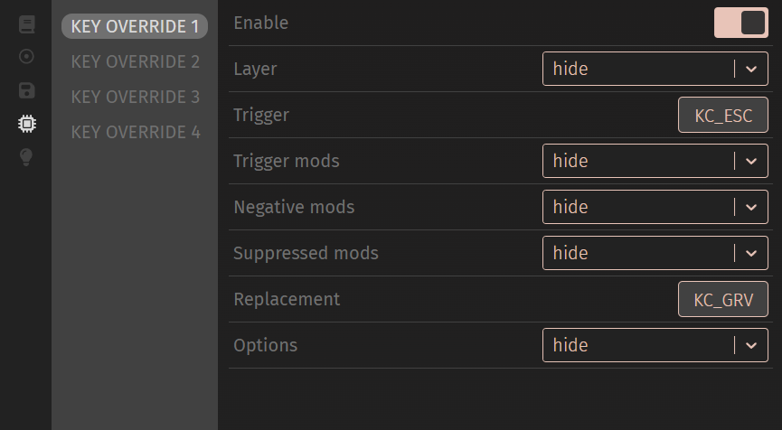

# qmk_dynamic_key_overrides
This helps adding dynamic key overrides on [qmk](https://docs.qmk.fm/) via keymap.
[Key Override](https://docs.qmk.fm/features/key_overrides) is a feature of qmk, but it can be more convenient if you can configure with [via app](https://usevia.app).

### Note

- Vial supports dynamic key overrides and much more.
If your keyboard supports qmk but not vial, [porting your keyboard to vial](https://get.vial.today/docs/porting-to-vial.html) would be better than implementing this in general.
This is made because porting to vial can be too difficult in some cases.
- A modified via json file is required to add custom UI items, even if your keyboard's via json is registered to via.
- This is NOT a stand-alone program. It's rather a group of files and instructions how to utilize them.

### How to apply

Pick NUM_KO, the number of key overrides you want to use.

You should set/find NUM_LAYER, the number of layers, as well.
Try to find `#define DYNAMIC_KEYMAP_LAYER_COUNT` in `config.h` or `-DDYNAMIC_KEYMAP_LAYER_COUNT` in `rules.mk`.
if `DYNAMIC_KEYMAP_LAYER_COUNT` is not defined, qmk sets `4`.

#### config.h

Copy `config.h` to your via keymap directory.
If `config.h` already exists in the via keymap directory, you need to merge them into one.
Modify `VKO_ENTRIES` as NUM_KO.

```c
#define VKO_ENTRIES 4                 // how many key_overrides to use
```

#### dynamic_key_overrides.c

Copy `dynamic_key_overrides.c` to your via keymap directory.
Then, add following lines to your `rules.mk` in via keymap.

```Makefile
KEY_OVERRIDE_ENABLE ?= yes
SRC += dynamic_key_overrides.c
```

#### generate_menu_item.py

Execute `generate_menu_item.py` to generate a JSON string of custom menu.
The below is an example of printing the JSON string.


```sh
python3 util/generate_menu_item.py --num_ko NUM_KO --num_layer NUM_LAYER
```

Copy the JSON string of custom menu to `menus` in your keyboard's via json file.

```JSON
"keycodes": ["qmk_lighting"],
"menus": [
  <PASTE HERE>
  {
    "label": "Lighting",
    "content": [
```

Open your JSON file in the design tab of via. You should be able to see custom UI as below.
Hidden controls will be displayed after selecting "show" in the dropdown.


